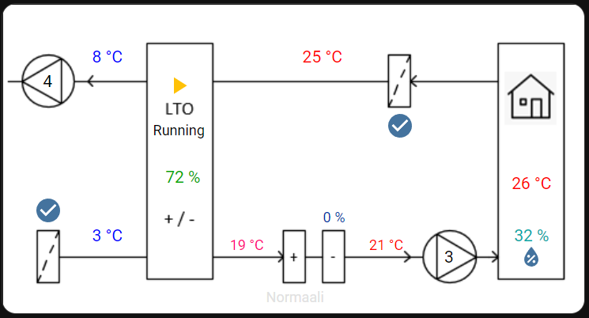
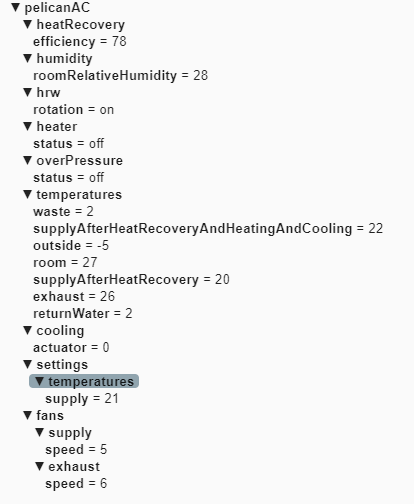

# pelican2mqtt

This program reads serial port communication from Enervent Pelican ACE ventilation machine and publishes the information to a MQTT broker.

## Build instructions

    dotnet build

## Usage

    dotnet run

## Settings

The following settings can be configured in the appsettings.json file.

|Setting|Description|
|---|---|
|mqtt:broker|Hostname of the MQTT broker
|mqtt:username|Username used to login to the MQTT broker
|mqtt:password|MQTT broker password
|serialPort|Name of the serial port to open, e.g. COM3

You may also customize the topics used to report different registers.

## Integration with Home Assistant

Once the program is running and MQTT topics are updating on the MQTT broker, the information can easily be used in Home Assistant.

Pelican2mqtt doesn't yet support MQTT discovery. Configuration must be performed manually.

### MQTT sensors

Temperature and other status sensor can be added to HA by adding the YAML definitions for the sensors in the system's configuration.yaml from
[this file](ha/configuration.yaml).

### Picture element

1. Place the [background image](ha/Pelican4.png) into HA's config/www directory.

2. Use the YAML in [this file](ha/picture-elements.yaml) in your "picture elements" dashboard element.

## Principle of operation

Enervent Pelican ACE uses a RS-485 serial bus in communicating with remote display and control units. Pelican broadcasts internal settings and statuses through the bus and receives commands and settings from the control units.

## MQTT

The following image shows the information published to the MQTT broker.

### Serial comm settings

Bit rate is 19200 bps, 8 data bits, no parity and one stop bit (8N1).

### Protocol details

Messages in the protocol have the following frame format:

|Byte|Hex value|Description|
|---|---|--|
|STX|0x80|Start byte
|SRC|0x01|Source address, always 1
|DST|0x01|Destination address, always 1
|LEN||Length of the message in bytes
|||Data bytes
|CRC||Simple checksum
|ETX|0x81|End byte

### Broadcast messages

|Command|Index|Description|
|---|---|--|
|E6|1|Supply air temperature|
||2|Exhaust air temperature|
||3|Waste air temperature|
||4|Outside temperature|
||5|Return water temperature|
||6|Supply air temperature just after HRW, but before heating element.|
|E7|1|Supply air temperature preset value|
||2|Exhaust air temperature preset value|
||3|Room temperature preset value|
||4|Low limit for supply air temperature|
||5|High limit for supply air temperature|
|E8|1|Supply fan normal speed setting|
||2|Exhaust fan normal speed setting|
||3|Supply fan speed setting in timer program|
||4|Exhaust fan speed setting in timer program|
||5|Supply fan speed setting when overpressurizing|
||6|Exhaust fan speed setting when overpressurizing|
